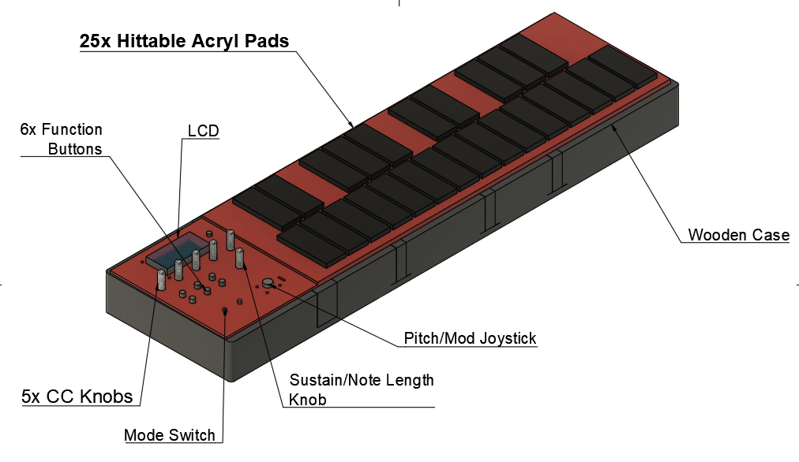

# MXylo
This repo serves as documentation for my Bachelor thesis project: MXylo: Xylophone MIDI Controller

MXylo is a Polyphonic USB MIDI Controller designed to be played with xylophone-style mallets, like a Xylophone would.

While the prototype was good enough to perform at a live demo, where pads were played and effects, as well as note length were all functioning, the physical design has some flaws which prevented me from doing further work on it, as well as making a proper showcase. Nevertheless, as a sole engineer working on the product I would like to at least show some of the work and considerations put into the project.

Key features include:

- 25 pressure-sensitive acryl pad sensors
- 6 function buttons including Octave +/- , Transpose +/- and Program Change
- Pitch/Mod controlled with a single joystick
- Programmable CC knobs
- Adjustable note length, using a turnable knob

## Hardware Parts and Components

Most of the components were chosen by a mixture of their functionality and availability - I had the pleasure to use a lot of Aarhus University ECE departments parts during the development of this project, so parts like buttons, switches, op-amps and the joystick were chosen specifically because they were there.

* [ESP32-S3 Devkit C1](https://docs.espressif.com/projects/esp-dev-kits/en/latest/esp32s3/esp32-s3-devkitc-1/index.html).
  * This is the MCU used for all control logic
  * While ESP32 MCU is traditionally used for network embedded software, the board sports some features which were attractive for this project, including good framework support in ESP-IDF, small size, an FPU (Floating Point Unit) allowing for fast float math operations, and it comes with a USB port out of the box. For industry-standard alternatives I would look into STM32-line microprocessors, they are widely used in music electronics
* [SparkFun 20x4 SerLCD](https://www.sparkfun.com/sparkfun-20x4-serlcd-rgb-backlight-qwiic.html)
  * An LCD display for displaying UI
  * Since there are a number of features such as transposition and CC effect control, an LCD UI display seemed in order. 4 lines allow for some leeway with where the information is presented. SerLCD has the option of many different interfaces, this project uses I2C since GPIO and pins were in short supply
* [CD74HC4067 MUX](https://www.ti.com/product/CD74HC4067?keyMatch=CD74HC4067&tisearch=universal_search&usecase=GPN)
  * Analog 16-1 Multiplexer.
  * ESP32-S3 has a total of 20 ADC inputs, some of them which might have to be used for other functionality such as I2C. This 16-1 Multiplexer, or rather, 3 of them were the solutions to reading from 40 analog signals (25 pads, 6 buttons, 5 knobs, 2 joystick axii, 2 switches). In practice each MUX needs 5 pins for control - 4 for choosing the channel with a 4 bit number, 1 for output
* [CD4078 OR GATE](https://www.ti.com/product/CD4078B?keyMatch=CD4078B&tisearch=universal_search&usecase=GPN)
  * This OR gate was used to facilitate button interrupts
* [Buttons](https://www.parts-express.com/Momentary-N.C.-Classic-Small-Push-Button-Switch-Black-3A-125V-060-634?quantity=1&srsltid=AfmBOoq62ASxzty8ygswH_6qMD5eCYZwBe-z3MahLhLdejqbj_IFyGUy)
  * Used for Transpose/Octave and Program change functionality
* [Switches](https://www.ebay.com/itm/282772538595?_skw=mini+momentary+switch+on+on&itmmeta=01K0Q5YD6QGRDATF6TGC0YKSXZ&hash=item41d68e84e3:g:CEkAAOSwlptaMnKF&itmprp=enc%3AAQAKAAABAFkggFvd1GGDu0w3yXCmi1fiPfFcDDa3rT5Nd4%2Fxjx8CPz4MUFC6YR8flvF959tHv8NE0XLBKEVjUHlSlIpf4L4bQoyXX9vSAG3%2F7GvZ0yB9xvebSFar%2FN8Jvt5%2FuDhisg2PfJO2P2KG4FVWxWK9Ios8OoYDWKIEsIFi9InEPPJ%2BcKWl%2Bkq%2FfSwFrFmtMhYwOkUdQafjOTxUDoGVSHfIoC7TGrwZGsBQfSIUprVNLeqUfr76bVM9wRkmwqwravsCnnOB8n0JQjV91FE5b9p0toLU4u7VmOjQyKXu%2FR%2BsNhVdjj3E%2B%2FTDewQOu%2B8Mza22ru0vTdTltt84hGJD01lmQwc%3D%7Ctkp%3ABk9SR8TT-eWFZg)
  * 1 used for PLAY/PROGRAM mode toggling, another one for resetting. I can no longer find the exact models, but the reset switch was momentary (snaps back to initial position), the mode switch was a 2-position switch
* [Power](https://www.elextra.dk/en-gb/p/breadboard-str%c3%b8mforsyningsmodul-33v-5v-ud/H32388)
  * This cool board has both 3.3V and 5.0V outputs as well as a 12V input (and USB just in case). I believe all of the components ran on 3.3V supply, but it's pretty sweet to have a choice like that out of the box

## Firmware

The firmware is using ESP-IDF framework for low level communication (adc, usb and i2c), as well as standard RTOS for various tasks such as polling peripherals, displaying UI on an LCD display and controlling note length.

